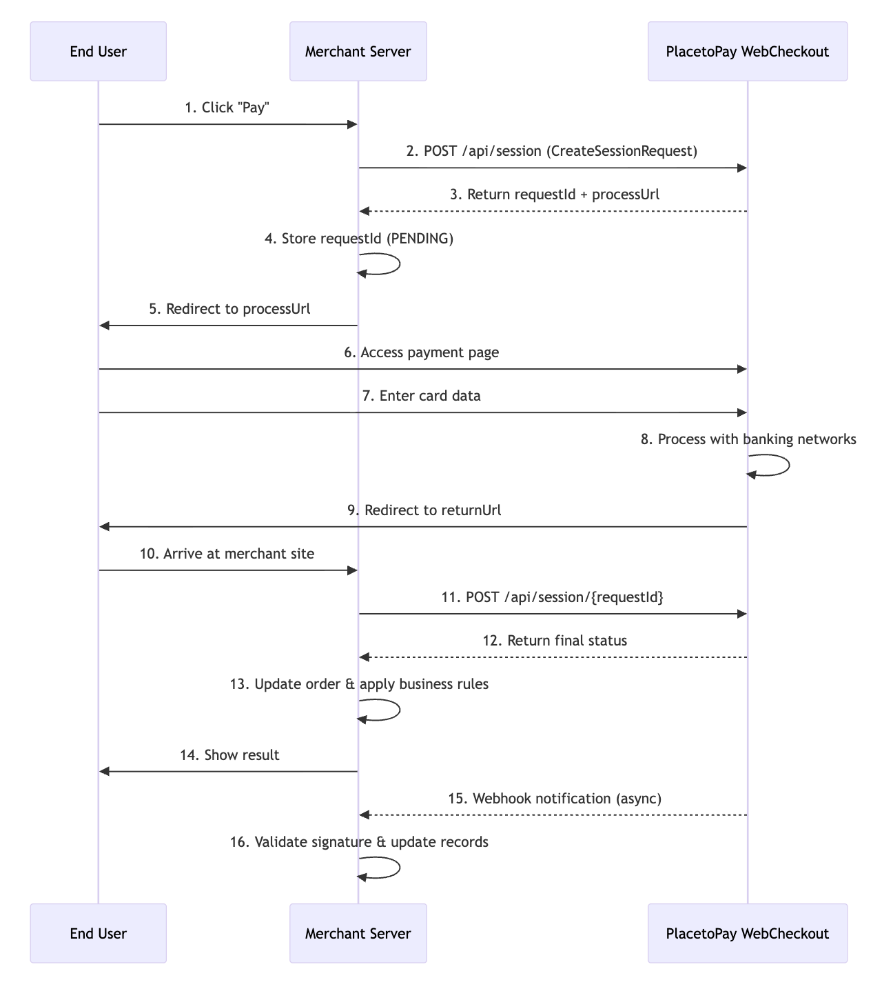

# Payment Flow Diagrams - PlacetoPay Integration

## 1. WebCheckout Payment Flow

WebCheckout provides a hosted payment page where users enter their payment information directly on PlacetoPay's secure interface.

### Flow Diagram (check image.png if it doesn't load here)



### Step-by-Step Description

| Step | Actor | Action | Description |
|------|-------|--------|-------------|
| 1 | End User | Click "Pay" | User initiates checkout on merchant's website |
| 2 | Merchant → PlacetoPay | POST /api/session | Create a checkout session with payment details |
| 3 | PlacetoPay → Merchant | Response | Returns `requestId` and `processUrl` |
| 4 | Merchant | Store data | Save `requestId` with PENDING status |
| 5 | Merchant → End User | Redirect | Send user to `processUrl` |
| 6 | End User → PlacetoPay | Access | User opens PlacetoPay's payment page |
| 7 | End User | Enter data | User fills in card and personal information |
| 8 | PlacetoPay | Process | Payment processed through banking networks |
| 9 | PlacetoPay → End User | Redirect | User sent back to `returnUrl` |
| 10 | End User → Merchant | Arrive | User returns to merchant's site |
| 11 | Merchant → PlacetoPay | Query session | Check final status of payment |
| 12 | PlacetoPay → Merchant | Response | Return APPROVED, REJECTED, or PENDING |
| 13 | Merchant | Update | Apply business rules based on status |
| 14 | Merchant → End User | Display | Show payment result to user |
| 15 | PlacetoPay → Merchant | Webhook | Async notification of final status |
| 16 | Merchant | Validate | Verify signature and update records |

---

## 2. API Gateway Payment Flow (check image-1.png if it doesn't load here)

API Gateway requires the merchant to capture sensitive card data directly and handle PCI compliance. This is for specialized use cases only.

### Flow Diagram


### Step-by-Step Description

| Step | Actor | Action | Description |
|------|-------|--------|-------------|
| 1 | End User → Merchant | Enter card data | User provides sensitive data on merchant's form (requires PCI compliance) |
| 2 | Merchant → PlacetoPay | POST /gateway/information | Send card number to get processing info |
| 3 | PlacetoPay → Merchant | Response | Returns available credits, OTP requirements, AVS, 3DS needs |
| 4 | Merchant | Conditional flows | Handle various requirements based on information response |
| 5 | End User | Confirm | User confirms payment with all required data |
| 6 | Merchant → PlacetoPay | POST /gateway/process | Submit complete payment request |
| 7 | PlacetoPay → Merchant | Response | Returns status, internalReference, authorization |
| 8 | Merchant | Store data | Save internalReference and authorization for future operations |
| 9 | Merchant | Handle pending | If PENDING, query periodically; if network failure, use search |
| 10 | Merchant → End User | Display | Show payment result |
| 11 | PlacetoPay → Merchant | Webhook | Optional async notification |

---

## 3. Comparison Summary

```
┌────────────────────────────────────────────────────────────────────────────┐
│                        WEBCHECKOUT vs API GATEWAY                          │
├────────────────────────────────────────────────────────────────────────────┤
│                                                                            │
│  ┌─────────────────────────────┐    ┌─────────────────────────────┐        │
│  │        WEBCHECKOUT          │    │        API GATEWAY          │        │
│  ├─────────────────────────────┤    ├─────────────────────────────┤        │
│  │                             │    │                             │        │
│  │  User ──► Merchant          │    │  User ──► Merchant          │        │
│  │           │                 │    │           │                 │        │
│  │           ▼                 │    │           │ (card data)     │        │
│  │       PlacetoPay            │    │           ▼                 │        │
│  │      (Create Session)       │    │       PlacetoPay            │        │
│  │           │                 │    │      (/information)         │        │
│  │           ▼                 │    │           │                 │        │
│  │  User ──► PlacetoPay        │    │           ▼                 │        │
│  │      (Payment Page)         │    │  User selects options       │        │
│  │           │                 │    │  (credits, OTP, etc.)       │        │
│  │           ▼                 │    │           │                 │        │ 
│  │  User ◄── Merchant          │    │           ▼                 │        │
│  │      (Return URL)           │    │       PlacetoPay            │        │
│  │           │                 │    │        (/process)           │        │
│  │           ▼                 │    │           │                 │        │
│  │       PlacetoPay            │    │           ▼                 │        │
│  │      (Query Status)         │    │  User ◄── Merchant          │        │
│  │                             │    │      (Show Result)          │        │
│  │                             │    │                             │        │
│  ├─────────────────────────────┤    ├─────────────────────────────┤        │
│  │ ✓ PlacetoPay handles        │    │ ✗ Merchant handles          │        │
│  │   sensitive data            │    │   sensitive data            │        │
│  │ ✓ PlacetoPay handles PCI    │    │ ✗ Mercant needs to implement|        |
|  |                             |    |   PCI compliance            │        │ 
│  │ ✓ Simpler integration       │    │ ✗ Complex integration       │        │
│  │ ✗ Less UI control           │    │ ✓ Full UI control           │        │
│  └─────────────────────────────┘    └─────────────────────────────┘        │
│                                                                            │
└────────────────────────────────────────────────────────────────────────────┘
```